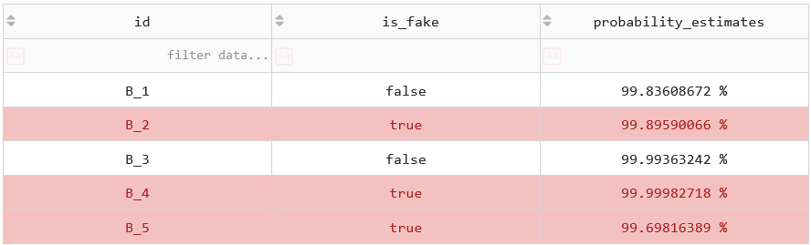

# Application Dash de détection de faux billets

> &#9888; Les éléments contenus dans ce dépôt ne sont qu'à objectif pédagogique.

## Informations

Ce dépôt contient les fichiers nécessaires au déploiement d'un algorithme de détection de faux billets dans une application Dash. Il s'agit d'un complément au [projet 10](https://github.com/anquetos/openclassrooms/tree/a848694f4e77dd1dd902e10b62eb67fe0957e511/projets/projet-10) réalisé dans le cadre du parcours de formation *[Data Analyst](https://openclassrooms.com/fr/paths/324-data-analyst)* dispensé par OpenClassrooms. En synthèse, ce projet a pour but de sélectionner et d'entraîner un algorithme permettant de détecter automatiquement des faux billets en se basant leurs seules caractéristiques dimensionnelles.

## Application Dash

L'application est disponible sur [render](https://render.com/) *via* ce lien : [Outil de détection de faux billets](https://detection-faux-billets-dash-app.onrender.com/). J'utilise une version gratuite, le chargement peut donc être un peu long.

### Données d'entrée

Pour utiliser l'application, il faut glisser-déposer ou ouvrir un fichier au format CSV contenant les variables suivantes :
* `height_left` : hauteur du bord gauche du billet (mm) ;
* `height_right` : hauteur du bord droit du billet (mm) ;
* `length` : longueur du billet (mm) ;
* `diagonal` : diagonale du billet (mm) ;
* `margin_up` : marge supérieure du billet (mm) ;
* `margin_low` : marge inférieure du billet (mm) ;
* `id` : identifiant du billet.

Afin de tester le fonctionnement de l'algorithme, différents fichiers sont disponibles dans le dossier [test-datasets](./test-datasets/).

### Fonctionnement

1. Glisser-déposer un fichier CSV. 
 
2. L'outil affiche un aperçu des données et vérifie la conformité des données. 
 
Si les données d'entrées ne sont pas valides, l'outil affiche le message d'erreur correspondant. 
 
 
Si les données sont correctes, le bouton **Prédire** apparaît, cliquer dessus pour effectuer la prédiction. 
 
3. L'outil affiche les résultats. : 
Le nombre de faux billets détectés. 
 
Les statistiques liés à la prédiction avec possibilité de trier et filtrer résultats. 
 
Un *scatter plot* intéractif permettant de visualiser les variables deux par deux et de les discriminer en fonction de l'authenticité des billets. 
 